Qubits are the most basic elements of quantum computing, just like classical bits for classical computers. However, there are two major differences between the two. First, it is well known that qubits, inhereitly, can be in superposition of logical 0 or 1 states as opposed to be in just one of them. Second, from an engineering point of view, we might never be able to manufacture (phyiscal) qubits as realible as classical bits we have today. To illustrate the difference, we can compare the quality of the first-generation of both. The first classical bits used on the giant ENIAC machine are a room of vacuum tubes (around 17000 in total). On average, there is only one tube that fails every two days.  On the other hand, for the first generation of qubits we have now, the average lifetime is on the scale of milisecond to second, depending on the technology, but in any case, it means after about a hundred operations, all qubits are expected to fail. Also, the fidelity drop of qubits is a continuous process (so the "lifetime" is actually defined to be the time point where the fidelity drops to 1/e), so your computation is corrupted  the moment after you initialize your qubits. 

Because of their robustness, in classical computing we do not care about the physical condition of the bits except the 0/1 values that they store. However, the fragility of qubits make error mitigation/correction an irreplaceable part of the computation. Can/Should we extract more information from each of our qubits to monitor their internal correctness and assist higher level error processing? Error correction schemes use redundant qubits to encode the information and then can afford to make measurements to collapse to a subspace and extract error messages. Here what we ask is more about each individual qubits. Is there any redundancy inside qubits that we should take advantage? To answer these questions, let's first examine some current qubit implementations.

 In principle, any physical state with two different energy levels can be used as a qubit. For example, the celebrated transmon qubits use the lowest two energy levels of the charge states in superconducting LC circuits with Josephson junctions; trapped ion qubits can be encoded in two ground-state hyperfine levels or a ground state  level and an excited level of an ion; quantum dot qubits use two electron spin triplet states. These information processing platforms have rather distinct physical characteristics, however, they all can encode a qubit.

It is to notice that these traditional implementations only use a small part of the physical space for storing the quantum information. To explain what it means, we will elaborate on the superconducting qubits as an example . Before we jump into quantum LC circuits, we can first consider a classical LC circuit. We know from high school that the equation of motion for LC circuits is the same with that of a pendulum or a spring (they are all called a harmonic oscillator). The voltage across the elements are oscillating sinusoidally and the current is oscillating cosinusoidally. If we plot the voltage (displacement, denoted as "Q") and current (speed, denoted as "P") of a LC circuit (a pendulum) at different time versus each other, the points will  form a circle (up to normalization) as illustrated below, and this plot is often referred as the phase space diagram. If the amplitude of the oscillation is higher (which implies the system energy is higher), the radius of the circle is larger. The motion with the lowest energy is a single point at the origin.  

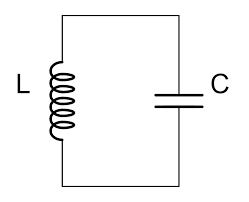       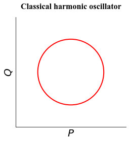

Superconducting qubits are based on the quantized version of the LC circuits, where one of the values got quantized is the energy. Thus, the "height" of the quantum pendulum can only take discrete values. What's more, the phase space diagram is not a circle anymore but a (quasi-)probability distribution in the phase space. We added the prefix "quasi-" here because the probability can be negative. We can look at the phase space diagram for the quantum motion with the lowest energy (which is called the ground state) and the motion with the second lowest energy (called first excited state), which are obtained by solving the Schrodinger's equation. In the following plots, red means positive probability, blue means negative probability and intensity indicates the numerical value. 

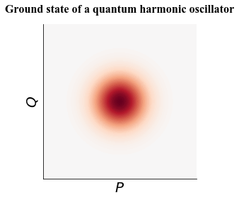       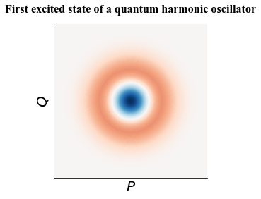

With the ability to prepare and manipulate these two states, we can encode a qubit in the quantum LC circuit with the ground state to be our logic 0 and the first excited state to be our logic 1. For example, we can have some electronic signals that happen to provide the energy difference $$\Delta E$$ between the two states (see figure below) then we can excite the qubit from the ground state to the first excited state, thus achieve the X gate: $$\bar{0}\rightarrow\bar{1}$$. But there is one more thing that we overlooked, that is the quantum harmonic oscillator has many levels and all the energy levels are equal spacing. Then the signal with energy $$\Delta E$$ will also transform $$\bar{1}\rightarrow\bar{2}$$. Similarly, it will make the transformation $$\frac{1}{\sqrt{2}}(\bar{0}+ \bar{1})\rightarrow\frac{1}{\sqrt{2}}(\bar{1}+ \bar{2})$$.  In both cases, it brings the state out of the logical space. We refer to this kind of error as leakage errors.

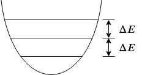

So we need to make some changes to make this plan work. The solution is to replace the inductor in the LC circuit with an element called the "Josephson junction", which is devised by Brian Josephson in 1962 and won him the Nobel prize in 1973. The inclusion of the Josephson junction turns the quantum harmonic oscillator into a quantum anharmonic oscillator in which the energy levels are not equal spacing anymore (thus "anharmonic"). In this way, we can selectively address the energy levels that we are interested. This design is the predecessor of the transmon qubit called the Cooper pair box. However, even in this case, we cannot completely mitigate leakage errors.

       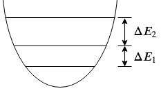

At this point, we explained why traditional qubits only uses part of the physical space and why leakage error could potentially be a problem. Now we come back to our original question: is there any way that a qubit can utilize the whole physical space in a way that avoid leakage errors are avoided and the redundant space may even provide us other error information? 

Well, there are many ways that we can use the whole physical space but there is a fundamental difficulty preventing us from extracting the error information --- **the Heisenberg uncertainty**. The Heisenberg uncertainty principle states that we cannot both be certain about the distribution along the $$P$$ and $$Q$$ direction. For example, we can "squeeze" the distribution of the $$P$$ direction of the ground state of a harmonic oscillator. Then if we measure the $$P$$ axis, the outcome will have a high probability of being near 0, but the measurement outcomes in $$Q$$ axis becomes more spreaded. Usually we need both $$P$$ and $$Q$$ information to completely describe the error messages unless we know that the error is biased.

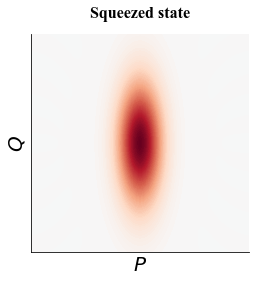  

To overcome the restriction brought by the Heisenberg uncertainty principle, Daniel Gottesman, Alexei Kitaev and John Preskill came up this beautiful idea that later being called the grid state, or the GKP state. We can take a look at its phase space diagram. 

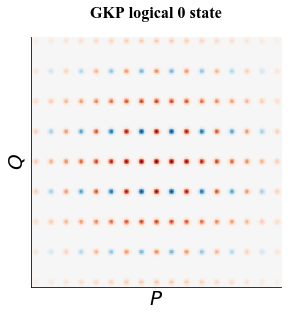       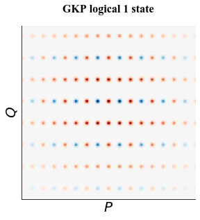

The grid coordinates of the logical 0 state are $$(k_p\sqrt{\pi}, 2k_q\sqrt{\pi})$$ and the grid coordinates of the logical 1 state are $$(k_p\sqrt{\pi}, (2k_q+1)\sqrt{\pi})$$, where $$k_p, k_q \in \mathbf{Z}$$. WIth the grid states, **we are still uncertain about the P and Q coordinates, but somehow we can detect the errors in both directions**, because even though we don not know which peak we will be measuring, we know that it must be multiples of $$\sqrt{\pi}$$ !  For example, we could measure an unknown GKP state to have $$Q$$ coordinate of $$2\sqrt{\pi}+\Delta q$$ or $$200\sqrt{\pi}+\Delta q$$,  no matter which outcome it is, we know that there must be an error of $$\Delta q$$, then we can shift its $$Q$$ value back by $$\Delta q$$, which is not hard to do experimentally.

What's more amazing is that, we can correct realistic errors other than shifts with something similar to stabilizer measurement in quantum error correction. With the help of an ancilla GKP qubit, we can always bring the damaged state back to the logical space. A dominant error source for quantum harmonic oscillators is photon losses, which will lower the energy levels in the state by 1. Photon losses will deform the grid states, however, if we perform a stabilizer measurement (see the circuit below, each qubit is a GKP qubit, $$X$$ corresponds to $$P$$ and $$Z$$ corresponds to $$Q$$) using a GKP ancilla, the GKP state will recover to a perfect lattice (possibly with a correctable shift error). 

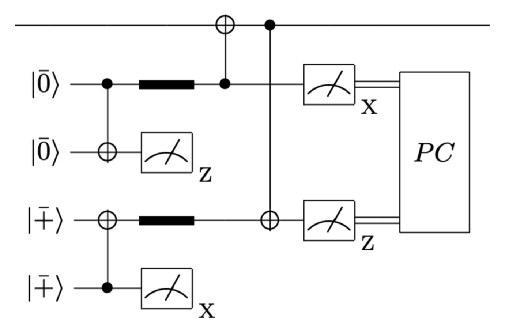            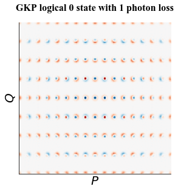

It turns out the $$P$$, $$Q$$ coordinate information GKP qubits provide is also extremely useful to an upper-level error correction code. Several work explored the idea of  combining surface code and GKP qubits and found that, with utilizing the continuous information of the $$P$$, $$Q$$ value in the surface code stabilizer measurement, the threshold can be improved by (number TBF). Now, we can answer the question asked in the beginning: should/can we extract more information from a qubit to assist higher level error correction? The answer is yes and it probably will help us build a reliable quantum computer sooner.

The downside of the GKP qubits though is that they are highly non-classical, thus making them is a non-trivial task. For example, on the superconducting platform, the high photon number in GKP states makes the usual first-order analysis fail. In a recent work, we performed high-order analysis to address the issue with its preparation and we gave fault-tolerance definitions to the GKP state preparation on superconducting platforms. 

As good as it is, GKP is not the only choice if we decide to use a quantum harmonic oscillator as a qubit. WIth knowing that photon losses is the main problem in many systems, there are other qubit encodings specifically designed for preventing it. The prominent ones are the cat code family and the binomial code family. Cat codes are superpositions of coherent states, which are Gaussian distributions in the phase space and are the eigenstates of the photon loss operator. In this way, photon losses will not deform the state but just change the relative phases of the coherent states in it (called dephasing). With the ability to continuously monitoring the photon parity (even or odd) using non-demolition measurement, the cat code can be constantly corrected by changing the relative phases back. Binomial codes is a family of codes designed for exactly recover $$S$$ photon losses and $$N$$ dephasing events. Binomial codes utilize the weighted combination of different energy levels to recover the photon losses and dephasing events. Here we draw their phase space diagrams. However, though specifically designed for realistic errors, it has been recently shown that these codes are outperformed by the GKP encoding. Also, people are still worried about their scalability because of the need of continuous measurements.

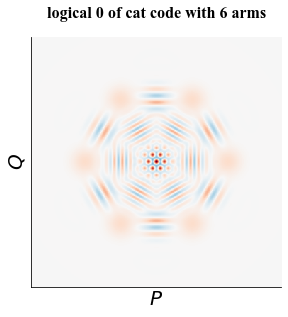            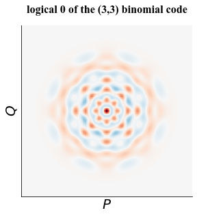

Rather than encoding the qubit inside a single quantum element like the oscillator, we can also make a qubit by assembling several components together. With careful design of the system engerym, this kind of qubits usually have some self-correcting ability, for example, in the topologically-protected $$0-\pi$$ qubit which is composed by a ladder of junctions,  the tunneling between the two logical states are exponentially suppressed. Another example is the VSLQ we mentioned in one of the previous blogs, with carefully engineered dissapation, the VSLQ will always bring itself back to the logical space just like the way the "useless machine" designed by Claude Shannon closes itself. We might need to devote another blog to introduce these qubits.

With error mitigation/correction being a crucial part of the computation, we expect alternative qubit architectures like the ones we talked about in this blog to be strong candidates for useful and realiable near-term quantum computing. Balancing the engineering difficulty and future potentials, GKP seems like the most promising qubit encoding for now, but we will probably see more interesting qubit designs utilizing the interplay between the underlying physics and high-level quantum information processing.
