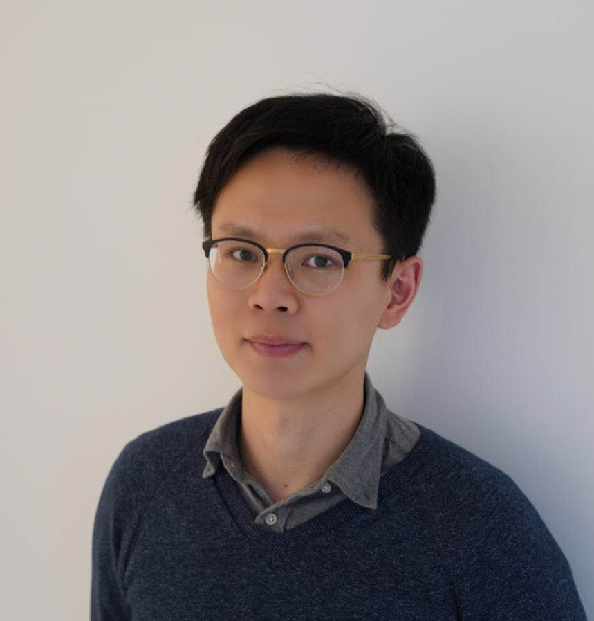

I am a 6th year graduate student, in the department of Physics, at the University of Chicago. I am in the quantum architecture group, under the supervision of Professor <a href="http://people.cs.uchicago.edu/~ftchong/"> Fred Chong</a>. My interests lie in:
<ul>
  <li>Quantum compilation optimization for near-term quantum devices. </li>
  <li>Alternative qubit architectures. </li>
  <li>Program verification for quantum computing.  </li>
</ul> 

Starting from August 2018, I spent one year at IBM Yorktown Heights under the <a href="https://qisenet.uchicago.edu">QISE-NET</a> fellowship, collaborating with Andrew W. Cross, Christopher Chamberland and Ali Javadi-Abhari on (1) quantum compilation optimization; (2) quantum verification (3) bosonic qubit encodings.

I also contributed to <a href="https://github.com/epiqc/ScaffCC">ScaffCC</a>, an industrial level quantum compiler capable of compiling quantum circuits of millions of quantum gates. I designed and implemented the circuit optimization pass in ScaffCC and wrote the QAOA (Quantum Approximate Optimization Algorithm) library. I designed a new compiler backend that directly compiles circuits to continuous control pulses.

In summer 2017, I was the <a href="http://www.mcs.anl.gov/career-opportunities/wj-cody-associates">WJ Cody fellow</a> in Argonne National Laborotary, collaborating with Professor Paul Hovland in the PROVESA project. I used formal verification and model checking to faciliate the safe migration of large numerical softwares to new super computing architecture. 

# Publications

	    <h3>Manuscripts</h3>
	    <ul>
            <li> <a href="../assets/publications/certiq.pdf">
              Contract-based Verification of a Realistic Quantum Compiler. </a> Yunong Shi, Xupeng Li, Runzhou Tao, Ali Javadi-Abhari, Andrew W. Cross, Fred T. Chong, Ronghui Gu
  	    </li>
        </ul>

	    <h3>Papers (first author)</h3>
	    <ul>
        <li>
            <a href="https://arxiv.org/pdf/1902.01474.pdf">Optimized Compilation of Aggregated Instructions for Realistic Quantum Computers</a> 
            Yunong Shi, Nelson Leung, Pranav Gokhale, Zane Rossi, David I. Schuster, Henry Hoffman, and Frederic T. Chong.
            <strong>International Symposium on Architectural Support for Programming Languages and Operating Systems (ASPLOS)</strong>. April 2019. Providence, RI.
  	    </li>

      <li>
           <a href="https://iopscience.iop.org/article/10.1088/1367-2630/ab3a62/pdf">Fault tolerant preparation of approximate GKP states </a> 
           Yunong Shi, Christopher Chamberland, Andrew W. Cross.
           <strong> New Journal of Physics</strong>. September 2019.
      </li>
      </ul>

	    <h3>Other papers</h3>
        <ul>
        <li>
           <a href="https://arxiv.org/pdf/1909.07522.pdf"> Partial Compilation of Variational Algorithms for Noisy Intermediate-Scale Quantum Machines </a> 
           Pranav Gokhale, Yongshan Ding, Thomas Propson, Christopher Winkler, Nelson Leung, Yunong Shi, David I Schuster, Henry Hoffmann, Frederic T Chong
        <strong> International Symposium on Microarchitecture (MICRO). </strong> October, 2019. Columbus, OH.
        </li>
        </ul>

