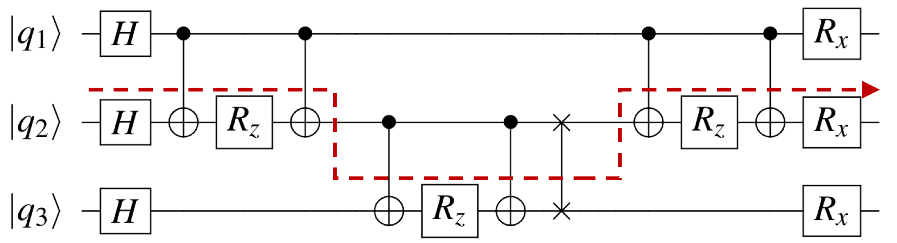
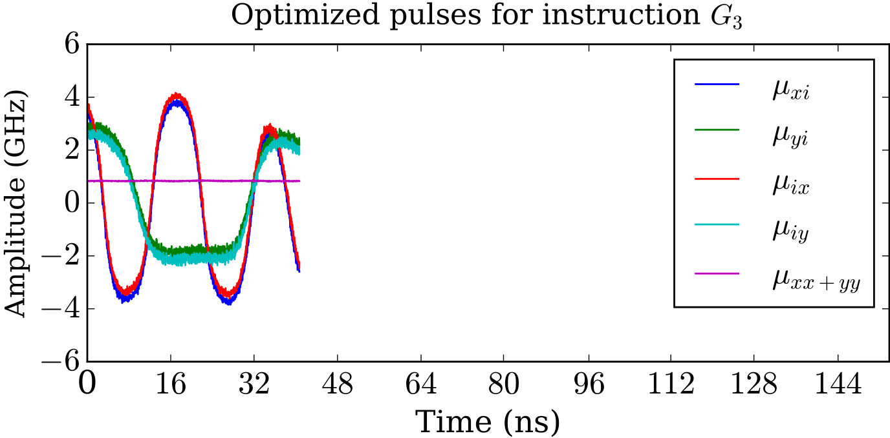
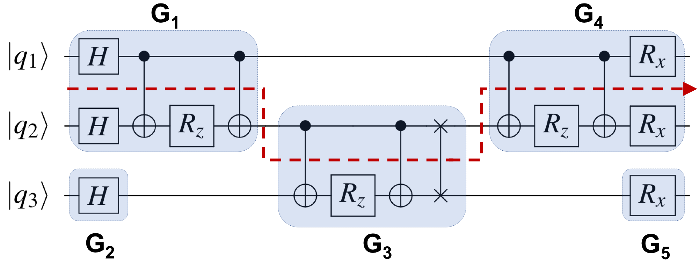
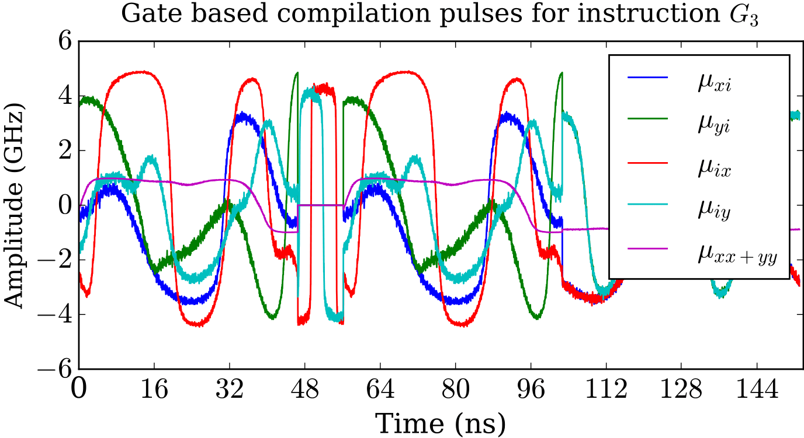

Pulse-level Quantum Compilation
-------------------

 Breaking the ISA abstraction 
 
We proposed a novel quantum compilation scheme that improves quantum circuit latency by 5X on average. Traditional compilation method first compiles quantum algorithms into pre-defined quantum gates (quantum ISA), then load corresponding control pulses in the hardware. Our approach form a new set of aggregated instructions for each circuit and generate customized control pulses with a quantum optimal control algorithm called GRAPE (GRadient-Ascent Pulse Engineering). This compilation
scheme is a core component of the NSF Expedition [<a href="epiqc.uchicago.edu">EPiQC</a>] and considered to "provide speed boost to quantum computers" by <a href="https://phys.org/news/2019-04-boost-quantum.html">phys.org</a>. 

* * *

Bosonic Qubit Architecture
------------------------

 Breaking the qubit abstraction 
 

***

CertiQ verification framework
-------------------------

 Reliable quantum software
 
