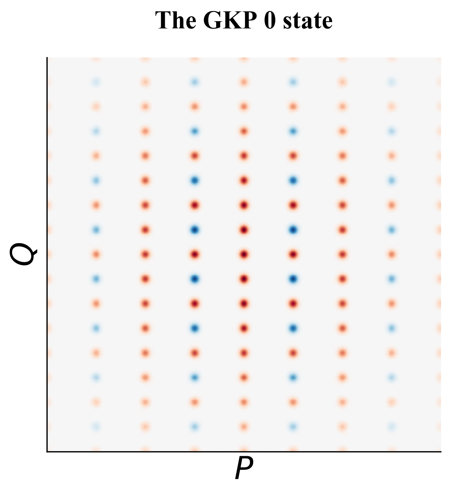

Pulse-level Quantum Compilation
-------------------

 Breaking the ISA abstraction 
 
We proposed a novel quantum compilation scheme that improves quantum circuit latency by 5X on average. Traditional compilation method first compiles quantum algorithms into pre-defined quantum gates (quantum ISA), then load corresponding control pulses in the hardware. Our approach form a new set of aggregated instructions for each circuit and generate customized control pulses with a quantum optimal control algorithm called GRAPE (GRadient-Ascent Pulse Engineering). This compilation
scheme is a core component of the NSF Expedition [<a href="epiqc.uchicago.edu">EPiQC</a>] and considered to "provide speed boost to quantum computers" by <a href="https://phys.org/news/2019-04-boost-quantum.html">phys.org</a>. 

  

        <h3>Related papers </h3>
	    <ul>
        <li>
            <a href="https://arxiv.org/pdf/1902.01474.pdf">Optimized Compilation of Aggregated Instructions for Realistic Quantum Computers</a> (ASPLOS'19)
  	    </li>

      <li>
           <a href="https://arxiv.org/pdf/1909.07522.pdf"> Partial Compilation of Variational Algorithms for Noisy Intermediate-Scale Quantum Machines </a>(MICRO'19)      </li>
      </ul>

* * *

Bosonic Qubit Architecture
------------------------

 Breaking the qubit abstraction 
 
Bosonic encodings such as the Gottesman-Kitaev-Preskill (GKP) code are qubit architectures that provide error information for upper-level software to monitor its internal correctness, thus are promising candidates for near-term quantum information processing. The GKP code breaks the fundamental limit set by the Heisenberg uncertainty principle. However, the GKP code is highly non-classical and hard to make. We gave fault tolerance definitions to the preparation of GKP states and designed protocols to fault-tolerantly preprare it.

***

CertiQ verification framework
-------------------------

 Reliable quantum software
 
